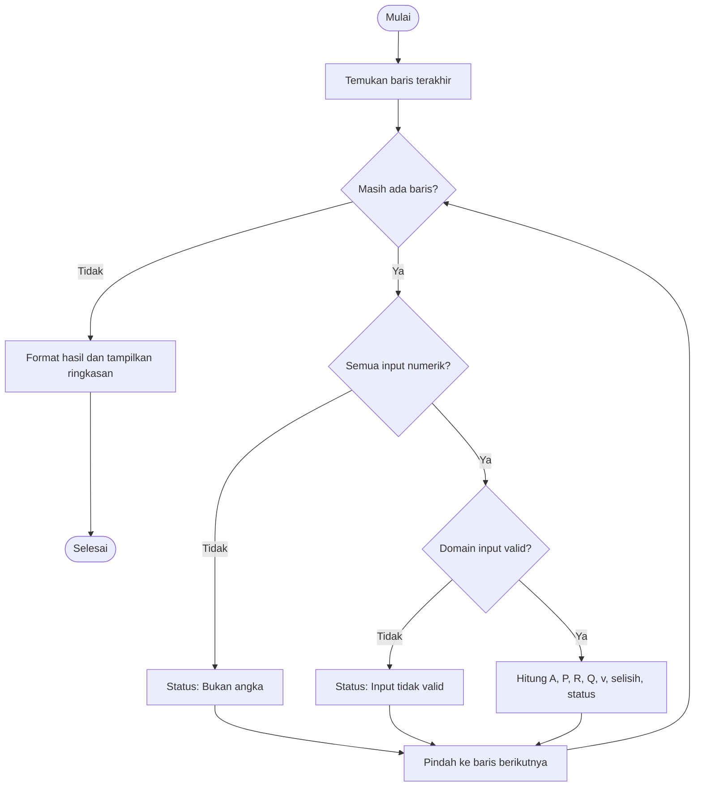

# Modul 7 — UserForm, Otomasi Terpadu, dan Praktik Integratif

## Capaian pembelajaran

Mahasiswa mampu:

- menjelaskan peran UserForm sebagai antarmuka dan menambahkan Control yang bernama jelas;
- membedakan property, method, dan event serta menulis event handler tombol;
- memvalidasi input form dan menggunakan kembali `Function` dari module standar;
- membuat fungsi konversi satuan yang eksplisit;
- menerjemahkan persamaan teknik menjadi fungsi VBA dengan variabel antara yang bermakna;
- mengotomasi hitungan untuk banyak baris data; serta
- merakit satu program kecil yang menggabungkan seluruh materi dan memverifikasinya terhadap hitungan manual.

## Alur 100 menit

| Menit | Kegiatan | Bagian |
|---:|---|---|
| 0–8 | Membandingkan input lewat sel dan form | §1 |
| 8–20 | Membuat UserForm, Control, property/method/event | §2–3 |
| 20–34 | Demo event tombol Hitung, Bersihkan, dan Tutup | §4–6 |
| 34–42 | Fungsi konversi satuan | §8 |
| 42–56 | Menerjemahkan persamaan Manning menjadi fungsi | §9 |
| 56–66 | Otomasi hitungan untuk banyak alternatif | §11 |
| 66–86 | Praktik integratif: evaluator alternatif saluran | §12 |
| 86–94 | Verifikasi manual dan empat pengujian wajib | §12 |
| 94–100 | Demonstrasi, simpan `.xlsm`, checklist akhir | Checklist |

**Keluaran minimum:** satu UserForm dengan tiga input dan validasi yang bekerja, satu fungsi Manning yang cocok dengan kasus acuan, dan satu tabel evaluasi berisi tiga alternatif valid serta satu input salah — disertai satu verifikasi manual.

Interpolasi linear (§10), padanan Python, dan pengembangan tampilan adalah pengayaan/PR.

---

## Bagian A — UserForm dan Control

## 1. Kapan menggunakan form?

Input langsung di worksheet sesuai untuk tabel besar dan data yang perlu terlihat bersama. UserForm sesuai untuk:

- memandu pengguna melalui sejumlah input tertentu;
- membatasi urutan dan pilihan;
- mengurangi risiko pengguna mengubah formula; dan
- memberi pesan validasi sebelum data disimpan.

Form tidak otomatis membuat program benar. Rumus, satuan, validasi, dan pengujian tetap diperlukan.

## 2. Membuat UserForm

1. Buka Visual Basic Editor dengan `Alt+F11`.
2. Pilih `Insert` → `UserForm`.
3. Pada Properties Window, ubah `(Name)` menjadi `frmVolume`.
4. Ubah `Caption` menjadi `Kalkulator Volume Beton`.
5. Tambahkan Control dari Toolbox.

| Jenis | `(Name)` | `Caption`/fungsi |
|---|---|---|
| Label | `lblPanjang` | Panjang (m) |
| TextBox | `txtPanjang` | input panjang |
| Label | `lblLebar` | Lebar (m) |
| TextBox | `txtLebar` | input lebar |
| Label | `lblTinggi` | Tinggi (m) |
| TextBox | `txtTinggi` | input tinggi |
| Label | `lblHasil` | Volume: — |
| CommandButton | `cmdHitung` | Hitung |
| CommandButton | `cmdBersihkan` | Bersihkan |
| CommandButton | `cmdTutup` | Tutup |

Nama seperti `txtPanjang` menjelaskan jenis dan makna Control — lebih mudah dirawat daripada nama bawaan `TextBox1`.

## 3. Property, method, dan event

- **Property** adalah keadaan/atribut, misalnya `Caption`, `Name`, `Value`, dan `Enabled`.
- **Method** adalah tindakan yang diminta, misalnya `SetFocus`, `Show`, dan `Hide`.
- **Event** adalah kejadian yang ditanggapi, misalnya `Click`, `Change`, dan `Initialize`.

```text
pengguna klik tombol
        ↓
event cmdHitung_Click
        ↓
baca property Value dari TextBox
        ↓
panggil Function VolumeBalok  ← fungsi dari Modul 6, tidak ditulis ulang
        ↓
ubah property Caption pada lblHasil
```

## 4. Menampilkan form

Pada module standar:

```vb
Option Explicit

Public Sub BukaFormVolume()
    frmVolume.Show
End Sub
```

Jalankan `BukaFormVolume` atau hubungkan macro ini ke tombol pada worksheet.

## 5. Event tombol Hitung

Klik ganda `cmdHitung`, lalu isi event handler:

```vb
Private Sub cmdHitung_Click()
    Dim panjang_m As Double
    Dim lebar_m As Double
    Dim tinggi_m As Double
    Dim volume_m3 As Double

    If Not IsNumeric(Me.txtPanjang.Value) Or _
       Not IsNumeric(Me.txtLebar.Value) Or _
       Not IsNumeric(Me.txtTinggi.Value) Then
        MsgBox "Semua dimensi harus berupa angka.", vbExclamation
        Exit Sub
    End If

    panjang_m = CDbl(Me.txtPanjang.Value)
    lebar_m = CDbl(Me.txtLebar.Value)
    tinggi_m = CDbl(Me.txtTinggi.Value)

    volume_m3 = VolumeBalok(panjang_m, lebar_m, tinggi_m)

    If volume_m3 < 0 Then
        MsgBox "Semua dimensi harus lebih besar dari nol.", vbExclamation
        Exit Sub
    End If

    Me.lblHasil.Caption = "Volume: " & _
                           Format(volume_m3, "0.000") & " m³"
End Sub
```

`Me` menunjuk UserForm tempat kode berada. Perhatikan bahwa **rumus volume tidak ada di dalam form** — form hanya membaca input, memanggil `VolumeBalok` dari Modul 6, dan menampilkan hasil. Inilah manfaat pemisahan `Function` dan `Sub` yang dibangun pada modul sebelumnya.

Urutannya juga sama seperti pada macro tabel: `IsNumeric` sebelum `CDbl`, lalu periksa hasil fungsi sebelum menampilkannya.

## 6. Event Bersihkan dan Tutup

```vb
Private Sub cmdBersihkan_Click()
    Me.txtPanjang.Value = ""
    Me.txtLebar.Value = ""
    Me.txtTinggi.Value = ""
    Me.lblHasil.Caption = "Volume: —"
    Me.txtPanjang.SetFocus
End Sub

Private Sub cmdTutup_Click()
    Unload Me
End Sub

Private Sub UserForm_Initialize()
    Me.lblHasil.Caption = "Volume: —"
    Me.txtPanjang.Value = ""
    Me.txtLebar.Value = ""
    Me.txtTinggi.Value = ""
End Sub
```

### Pengujian form

| Kasus | p | l | t | Hasil yang diharapkan |
|---|---:|---:|---:|---|
| Normal | 10 | 2 | 0,3 | 6,000 m³ |
| Nol | 0 | 2 | 0,3 | pesan dimensi harus > 0 |
| Teks | `sepuluh` | 2 | 0,3 | pesan harus berupa angka |
| Pecahan | 1,5 | 0,2 | 0,4 | 0,120 m³ |

## 7. Batas desain antarmuka

- selalu tampilkan satuan;
- gunakan urutan tab yang logis;
- jangan mengandalkan warna sebagai satu-satunya pesan;
- berikan pesan yang menyebutkan apa yang salah **dan** cara memperbaikinya;
- jangan menyimpan hasil sebelum input valid; dan
- sediakan cara membatalkan atau menutup form.

---

## Bagian B — Otomasi perhitungan teknik

## 8. Konversi satuan sebagai fungsi

Konversi yang berulang sebaiknya dibuat sebagai fungsi agar tidak ada faktor yang ditulis berbeda di banyak tempat — versi kode dari disiplin satuan pada Modul 2 §7.

```vb
Option Explicit

Public Function MmKeM(ByVal panjang_mm As Double) As Double
    MmKeM = panjang_mm / 1000#
End Function

Public Function LiterPerDetikKeM3s(ByVal debit_Ls As Double) As Double
    LiterPerDetikKeM3s = debit_Ls / 1000#
End Function

Public Function DerajatKeRadian(ByVal sudut_derajat As Double) As Double
    Const PI As Double = 3.14159265358979
    DerajatKeRadian = sudut_derajat * PI / 180#
End Function
```

Uji cepat di Immediate Window:

| Input | Harapan |
|---|---:|
| `MmKeM(2500)` | `2,5 m` |
| `LiterPerDetikKeM3s(500)` | `0,5 m³/s` |
| `DerajatKeRadian(180)` | `π rad` |

## 9. Menerjemahkan persamaan: Manning

Untuk latihan, debit aliran seragam dihitung dengan persamaan Manning SI:

```text
Q = (1/n) × A × R^(2/3) × S^(1/2)
```

dengan `n` = koefisien Manning, `A` = luas basah (m²), `R` = jari-jari hidraulik (m), dan `S` = kemiringan energi (m/m). Untuk saluran persegi panjang dengan lebar dasar `b` dan kedalaman air `y`:

```text
A = b × y
P = b + 2y
R = A/P
```

```vb
' Menghitung debit Manning untuk saluran persegi panjang.
' Semua panjang dalam m; S dalam m/m; hasil dalam m³/s.
' Mengembalikan -1 jika input tidak valid.
Public Function DebitManningPersegi( _
    ByVal lebar_m As Double, _
    ByVal kedalaman_m As Double, _
    ByVal koefManning As Double, _
    ByVal kemiringan As Double) As Double

    Dim luas_m2 As Double
    Dim kelilingBasah_m As Double
    Dim radiusHidraulik_m As Double

    If lebar_m <= 0 Or kedalaman_m <= 0 Or _
       koefManning <= 0 Or kemiringan < 0 Then
        DebitManningPersegi = -1
        Exit Function
    End If

    luas_m2 = lebar_m * kedalaman_m
    kelilingBasah_m = lebar_m + 2# * kedalaman_m
    radiusHidraulik_m = luas_m2 / kelilingBasah_m

    DebitManningPersegi = (1# / koefManning) * luas_m2 * _
                           radiusHidraulik_m ^ (2# / 3#) * _
                           kemiringan ^ 0.5
End Function
```

Persamaan dipecah menjadi **variabel antara yang bermakna** (`luas_m2`, `kelilingBasah_m`, `radiusHidraulik_m`), bukan ditulis sebagai satu baris panjang. Setiap variabel antara dapat diperiksa sendiri di Immediate Window ketika hasil akhirnya mencurigakan. Tulisan `2# / 3#` menegaskan operasi pecahan bertipe `Double`.

### Kasus acuan

Untuk `b = 2 m`, `y = 1 m`, `n = 0,015`, dan `S = 0,001`:

- `A = 2 m²`;
- `P = 4 m`;
- `R = 0,5 m`; dan
- **`Q ≈ 2,6561 m³/s`**.

> Persamaan ini adalah contoh pembelajaran. Penggunaan untuk desain memerlukan penetapan parameter, kondisi aliran, geometri, dan standar yang tepat.

## 10. Interpolasi linear (pengayaan)

Jika diketahui `(x1, y1)` dan `(x2, y2)`, nilai pada `x` di antaranya adalah:

```text
y = y1 + (x - x1) × (y2 - y1) / (x2 - x1)
```

```vb
Public Function InterpolasiLinear( _
    ByVal x As Double, _
    ByVal x1 As Double, ByVal y1 As Double, _
    ByVal x2 As Double, ByVal y2 As Double) As Variant

    If x2 = x1 Then
        InterpolasiLinear = CVErr(xlErrDiv0)
    ElseIf x < WorksheetFunction.Min(x1, x2) Or _
           x > WorksheetFunction.Max(x1, x2) Then
        InterpolasiLinear = CVErr(xlErrNA)
    Else
        InterpolasiLinear = y1 + (x - x1) * (y2 - y1) / (x2 - x1)
    End If
End Function
```

Fungsi mengembalikan galat Excel jika dua titik memiliki `x` sama atau jika diminta melakukan **ekstrapolasi**. Kebijakan ini membuat batas penggunaan terlihat jelas alih-alih diam-diam menghasilkan angka di luar rentang data.

Untuk `(x1, y1) = (10, 100)` dan `(x2, y2) = (20, 160)`: pada `x = 10` hasilnya `100`, pada `x = 15` hasilnya `130`, dan pada `x = 20` hasilnya `160`.

## 11. Otomasi hitungan berulang

Buat tabel pada lembar `Manning` dengan kolom A–G: Alternatif, `b`, `y`, `n`, `S`, `Q`, Status.

```vb
Sub HitungAlternatifManning()
    Dim ws As Worksheet
    Dim baris As Long
    Dim barisTerakhir As Long
    Dim hasilQ As Double

    Set ws = ThisWorkbook.Worksheets("Manning")
    barisTerakhir = ws.Cells(ws.Rows.Count, "A").End(xlUp).Row

    For baris = 2 To barisTerakhir
        If IsNumeric(ws.Cells(baris, "B").Value) And _
           IsNumeric(ws.Cells(baris, "C").Value) And _
           IsNumeric(ws.Cells(baris, "D").Value) And _
           IsNumeric(ws.Cells(baris, "E").Value) Then

            hasilQ = DebitManningPersegi( _
                CDbl(ws.Cells(baris, "B").Value), _
                CDbl(ws.Cells(baris, "C").Value), _
                CDbl(ws.Cells(baris, "D").Value), _
                CDbl(ws.Cells(baris, "E").Value))

            If hasilQ >= 0 Then
                ws.Cells(baris, "F").Value = hasilQ
                ws.Cells(baris, "G").Value = "OK"
            Else
                ws.Cells(baris, "F").ClearContents
                ws.Cells(baris, "G").Value = "Input tidak valid"
            End If
        Else
            ws.Cells(baris, "F").ClearContents
            ws.Cells(baris, "G").Value = "Bukan angka"
        End If
    Next baris

    ws.Range("F2:F" & barisTerakhir).NumberFormat = "0.0000"
End Sub
```

Polanya identik dengan `HitungSemuaDebit` pada Modul 5 §9. Yang berubah hanya fungsi hitungannya — bukti bahwa pemisahan alur dan rumus benar-benar berbuah.

---

## Bagian C — Praktik integratif

## 12. Evaluator alternatif saluran persegi panjang

Program membaca beberapa alternatif geometri saluran dari Excel, menghitung parameter hidraulik dengan persamaan Manning, dan membandingkan debit hitungan terhadap debit target.

> Studi kasus ini ditujukan untuk pembelajaran algoritma. Hasilnya bukan desain siap konstruksi dan tidak menggantikan analisis serta standar teknik yang berlaku.

### Spesifikasi

**Input per alternatif:** nama, lebar dasar `b` (m), kedalaman air `y` (m), koefisien Manning `n`, kemiringan `S` (m/m), dan debit target `Q_target` (m³/s).

**Proses:**

```text
A = b × y
P = b + 2y
R = A/P
Q = (1/n) × A × R^(2/3) × S^(1/2)
v = Q/A
selisih_persen = (Q - Q_target) / Q_target × 100%
```

**Output:** `A`, `P`, `R`, `Q`, `v`, selisih (%), dan status `Mencapai target` atau `Belum mencapai target`.

### Struktur worksheet `Evaluasi`

| Kolom | Judul | Kolom | Judul |
|---|---|---|---|
| A | Alternatif | H | Keliling P (m) |
| B | Lebar b (m) | I | Radius R (m) |
| C | Kedalaman y (m) | J | Q hitung (m³/s) |
| D | Manning n | K | Kecepatan v (m/s) |
| E | Kemiringan S (m/m) | L | Selisih (%) |
| F | Q target (m³/s) | M | Status |
| G | Luas A (m²) | | |

Data awal:

| Alternatif | b | y | n | S | Q target |
|---|---:|---:|---:|---:|---:|
| A | 2,00 | 1,00 | 0,015 | 0,0010 | 2,50 |
| B | 2,50 | 0,80 | 0,015 | 0,0010 | 2,50 |
| C | 1,80 | 1,20 | 0,017 | 0,0015 | 3,00 |
| Uji salah | 0,00 | 1,00 | 0,015 | 0,0010 | 2,00 |

### Alur program



### Rancangan modular

Program dibagi menjadi:

- `InputBarisNumerik` — memeriksa tipe input;
- `InputHidraulikValid` — memeriksa domain nilai;
- `DebitManningPersegi` — menghitung debit (**dipakai ulang dari §9**);
- `BersihkanHasil` — menghapus hasil lama; dan
- `EvaluasiSemuaAlternatif` — mengatur seluruh alur.

Susun pseudocode sendiri lebih dulu. Kode acuan dibuka setelah Anda punya rancangan dan sudah mencoba menjalankannya.

```vb
Option Explicit

Private Function InputBarisNumerik( _
    ByVal ws As Worksheet, ByVal baris As Long) As Boolean

    Dim kolom As Long

    InputBarisNumerik = True
    For kolom = 2 To 6
        If Not IsNumeric(ws.Cells(baris, kolom).Value) Then
            InputBarisNumerik = False
            Exit Function
        End If
    Next kolom
End Function

Private Function InputHidraulikValid( _
    ByVal lebar_m As Double, ByVal kedalaman_m As Double, _
    ByVal koefManning As Double, ByVal kemiringan As Double, _
    ByVal target_m3s As Double) As Boolean

    InputHidraulikValid = (lebar_m > 0) And (kedalaman_m > 0) And _
                          (koefManning > 0) And (kemiringan >= 0) And _
                          (target_m3s > 0)
End Function

Private Sub BersihkanHasil(ByVal ws As Worksheet, ByVal baris As Long)
    ws.Range(ws.Cells(baris, "G"), ws.Cells(baris, "L")).ClearContents
End Sub

Public Sub EvaluasiSemuaAlternatif()
    On Error GoTo TanganiGalat

    Dim ws As Worksheet
    Dim baris As Long
    Dim barisTerakhir As Long
    Dim jumlahValid As Long
    Dim lebar_m As Double, kedalaman_m As Double
    Dim koefManning As Double, kemiringan As Double
    Dim target_m3s As Double
    Dim luas_m2 As Double, kelilingBasah_m As Double
    Dim radiusHidraulik_m As Double
    Dim debit_m3s As Double, kecepatan_ms As Double
    Dim selisih_persen As Double

    Set ws = ThisWorkbook.Worksheets("Evaluasi")
    barisTerakhir = ws.Cells(ws.Rows.Count, "A").End(xlUp).Row

    For baris = 2 To barisTerakhir
        BersihkanHasil ws, baris

        If Not InputBarisNumerik(ws, baris) Then
            ws.Cells(baris, "M").Value = "Bukan angka"
        Else
            lebar_m = CDbl(ws.Cells(baris, "B").Value)
            kedalaman_m = CDbl(ws.Cells(baris, "C").Value)
            koefManning = CDbl(ws.Cells(baris, "D").Value)
            kemiringan = CDbl(ws.Cells(baris, "E").Value)
            target_m3s = CDbl(ws.Cells(baris, "F").Value)

            If Not InputHidraulikValid(lebar_m, kedalaman_m, _
                       koefManning, kemiringan, target_m3s) Then
                ws.Cells(baris, "M").Value = "Input tidak valid"
            Else
                luas_m2 = lebar_m * kedalaman_m
                kelilingBasah_m = lebar_m + 2# * kedalaman_m
                radiusHidraulik_m = luas_m2 / kelilingBasah_m
                debit_m3s = DebitManningPersegi(lebar_m, kedalaman_m, _
                                                koefManning, kemiringan)
                kecepatan_ms = debit_m3s / luas_m2
                selisih_persen = (debit_m3s - target_m3s) / target_m3s * 100#

                ws.Cells(baris, "G").Value = luas_m2
                ws.Cells(baris, "H").Value = kelilingBasah_m
                ws.Cells(baris, "I").Value = radiusHidraulik_m
                ws.Cells(baris, "J").Value = debit_m3s
                ws.Cells(baris, "K").Value = kecepatan_ms
                ws.Cells(baris, "L").Value = selisih_persen

                If debit_m3s >= target_m3s Then
                    ws.Cells(baris, "M").Value = "Mencapai target"
                Else
                    ws.Cells(baris, "M").Value = "Belum mencapai target"
                End If

                jumlahValid = jumlahValid + 1
            End If
        End If
    Next baris

    ws.Range("G2:K" & barisTerakhir).NumberFormat = "0.0000"
    ws.Range("L2:L" & barisTerakhir).NumberFormat = "0.00"

    MsgBox jumlahValid & " alternatif berhasil dihitung.", vbInformation
    Exit Sub

TanganiGalat:
    MsgBox "Program berhenti: " & Err.Description, vbCritical
End Sub
```

### Verifikasi manual alternatif A

Dengan `b = 2`, `y = 1`, `n = 0,015`, `S = 0,001`, dan target `2,5`:

```text
A = 2 × 1 = 2 m²
P = 2 + 2(1) = 4 m
R = 2/4 = 0,5 m
Q = (1/0,015) × 2 × 0,5^(2/3) × 0,001^(1/2)
Q ≈ 2,6561 m³/s
v = 2,6561/2 ≈ 1,3281 m/s
selisih ≈ (2,6561 - 2,5)/2,5 × 100% ≈ 6,25%
status = Mencapai target
```

Perbedaan kecil pada digit terakhir dapat terjadi karena pembulatan. Program harus menyimpan presisi penuh dan hanya membulatkan **tampilannya**.

### Rencana pengujian

| ID | Prioritas | Kasus | Contoh | Hasil yang diharapkan |
|---|---|---|---|---|
| T1 | Wajib | Normal/acuan | alternatif A | `Q ≈ 2,6561`; mencapai target |
| T2 | Pengayaan | Tepat target | target = Q hitung | mencapai target |
| T3 | Wajib | Dimensi nol | `b = 0` | input tidak valid |
| T4 | Pengayaan | Nilai negatif | `S = -0,001` | input tidak valid |
| T5 | Wajib | Salah tipe | `n = abc` | bukan angka |
| T6 | Wajib | Banyak baris | tiga valid + satu salah | semua baris tetap diproses |

Catat input, hasil harapan, hasil aktual, dan status lulus/gagal untuk setiap uji.

### Demonstrasi individu (3–5 menit)

1. jelaskan input–proses–output;
2. jalankan program pada satu kasus normal;
3. masukkan satu data salah dan jelaskan respons program;
4. tunjukkan satu verifikasi manual; dan
5. jelaskan satu fungsi dan satu percabangan dalam kode.

### Rubrik

| Aspek | Bobot | Indikator utama |
|---|---:|---|
| Algoritma dan modularitas | 20% | alur benar; fungsi/prosedur terpisah jelas |
| Ketepatan hitungan | 25% | rumus, satuan, dan hasil acuan benar |
| Validasi dan penanganan galat | 15% | input buruk ditangani tanpa hasil palsu |
| Pengujian dan verifikasi | 20% | empat kasus uji wajib dan satu hitungan manual |
| Keterbacaan dan dokumentasi | 10% | nama variabel, komentar, dan petunjuk jelas |
| Demonstrasi individu | 10% | mampu menjalankan dan menjelaskan program |

### Pengayaan/PR

- hubungkan evaluator ini ke UserForm agar satu alternatif dapat diuji cepat sebelum dimasukkan ke tabel;
- beri warna hijau/kuning/merah pada status;
- buat grafik perbandingan `Q hitung` dan `Q target`;
- pindahkan pengolahan tabel ke array 2D agar lebih efisien; atau
- tulis ulang satu fungsi dalam Python dan bandingkan hasilnya.

## Kuis berdampak — 3 soal

### 1. Prediksi

Pengguna mengetik `abc` pada `txtPanjang` lalu menekan Hitung. Urutkan statement penting yang berjalan dan jelaskan mengapa `CDbl` tidak dipanggil.

### 2. Praktik perbaikan

Pada `EvaluasiSemuaAlternatif`, seorang mahasiswa menghapus pemanggilan `BersihkanHasil`. Program tetap berjalan tanpa pesan galat. Jelaskan apa yang terlihat di layar ketika baris yang tadinya valid diubah menjadi `b = 0`, dan mengapa itu berbahaya.

### 3. Jelaskan

Kelompokkan contoh berikut sebagai property, method, atau event: `Caption`, `SetFocus`, `Click`, `Value`, `Show`, `Initialize`. Lalu jelaskan mengapa `frmVolume` tidak memuat rumus volume sama sekali, dan apa untungnya ketika rumus itu ternyata harus diperbaiki.

<details>
<summary>Kunci dan indikator pemahaman</summary>

1. Event `cmdHitung_Click` berjalan, `IsNumeric` menghasilkan `False`, pesan muncul, lalu `Exit Sub`. Karena keluar lebih awal, `CDbl` tidak dijalankan dan tidak menghasilkan *type mismatch*.
2. Kolom G–L masih menampilkan **hasil perhitungan lama**, sementara kolom M berubah menjadi `Input tidak valid`. Baris itu tampak punya nilai `Q`, `v`, dan selisih yang sah padahal inputnya sudah ditolak — pembaca tabel dapat memakai angka yang sudah tidak berlaku. Menghapus hasil lama adalah bagian dari validasi, bukan kosmetik.
3. Property: `Caption`, `Value`; method: `SetFocus`, `Show`; event: `Click`, `Initialize`. Form hanya membaca input, memanggil `VolumeBalok`, dan menampilkan hasil. Jika rumus harus diperbaiki, perbaikan cukup dilakukan di satu `Function` dan langsung berlaku untuk form, macro tabel, dan pemakaian di sel Excel sekaligus.

</details>

## Checklist akhir

- [ ] Semua Control mempunyai nama yang bermakna.
- [ ] Saya membedakan property, method, dan event.
- [ ] Validasi dilakukan sebelum `CDbl` dan sebelum hitungan.
- [ ] Form menggunakan `Function` dari module standar, tanpa menyalin rumus.
- [ ] Konversi satuan dibuat eksplisit dan diuji.
- [ ] Persamaan dipecah menjadi variabel antara yang bermakna.
- [ ] Hasil lama dibersihkan sebelum baris dihitung ulang.
- [ ] Program memproses semua baris, termasuk setelah baris yang salah.
- [ ] Hasil acuan `Q ≈ 2,6561 m³/s` cocok dalam toleransi yang dinyatakan.
- [ ] Workbook tersimpan sebagai `.xlsm`, `Option Explicit` aktif, dan berhasil di-compile.
- [ ] Saya mampu menjelaskan kode dengan kata-kata sendiri.

## Ringkasan

UserForm menghubungkan pengguna dengan algoritma, fungsi konversi dan fungsi persamaan menjaga satuan serta rumus tetap pada satu tempat, dan loop menerapkannya pada banyak alternatif sekaligus. Ketiganya bertemu pada praktik integratif ini.

Program teknik yang baik bukan program yang paling panjang. Program yang baik memiliki alur jelas, input yang terjaga, perhitungan yang dapat ditelusuri, dan bukti bahwa hasilnya telah diuji.

## Bacaan lanjut

1. Michael Alexander & Dick Kusleika, *Excel 2019 Power Programming with VBA*, Wiley, 2019.
2. Bill Jelen & Tracy Syrstad, *Microsoft Excel VBA and Macros (Office 2021 and Microsoft 365)*, Microsoft Press, 2022.
3. Steve Krug, *Don't Make Me Think, Revisited: A Common Sense Approach to Web Usability*, 3rd ed., New Riders, 2014.
4. Ben Shneiderman dkk., *Designing the User Interface: Strategies for Effective Human-Computer Interaction*, 6th ed., Pearson, 2016.
5. Steven C. Chapra & Raymond P. Canale, *Numerical Methods for Engineers*, 8th ed., McGraw-Hill, 2021.

[← Modul 6](06-modularitas-data-dan-pengujian.md) · [Daftar modul](README.md)
