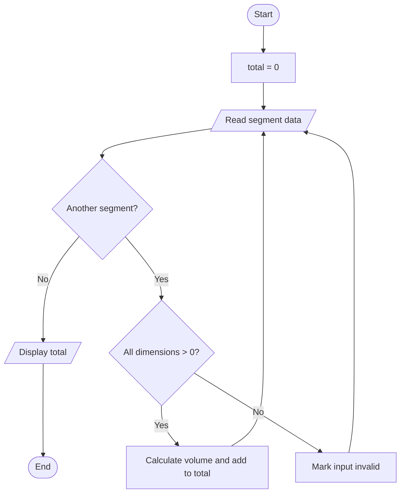

# Module 4 — Algorithms and Their Elements

## Learning outcomes

Students will be able to:

- decompose an engineering problem into input–process–output;
- distinguish sequence, selection, and repetition;
- express an algorithm in natural language, pseudocode, and a flowchart;
- trace changing values in a table; and
- explain the relationship between an algorithm and a computer program.

## 100-minute sequence

| Minutes | Activity |
|---:|---|
| 0–10 | Arrange a shuffled set of instructions |
| 10–25 | Algorithm definition and IPO |
| 25–40 | Sequence, selection, and repetition |
| 40–55 | Pseudocode for an excavation-volume case |
| 55–70 | Flowchart and trace table |
| 70–82 | Translate the algorithm to Excel/VBA |
| 82–95 | Three-question quiz |
| 95–100 | Review and checklist |

**Minimum product:** one IPO table, pseudocode, flowchart, and trace table for a civil engineering volume problem.

## 1. Decompose the problem

Case: calculate the total excavation volume of several rectangular segments.

Before writing code, ask:

1. What data is available?
2. What data is missing?
3. Which formula and assumptions apply?
4. What output is required?
5. How will the result be checked?

| Component | Content |
|---|---|
| Input | length, width, and depth of each segment |
| Process | validate dimensions, calculate each volume, add valid volumes |
| Output | volume per segment and total volume |
| Validation | one manual calculation and a positive-dimension check |

## 2. Definition and essential properties

An algorithm is a finite, unambiguous, executable sequence of steps that transforms input into output. A useful algorithm has:

- a clear start and end;
- defined input and output;
- unambiguous steps;
- an executable order;
- a stopping condition; and
- a way to check the result.

An algorithm is independent of language. The same logic can be implemented in an Excel formula, VBA, Python, or a manual calculation.

## 3. Three fundamental structures

### Sequence

```text
read length
read width
read depth
calculate volume
display volume
```

### Selection

```text
IF all dimensions > 0
  calculate volume
ELSE
  display "Invalid input"
END IF
```

### Repetition

```text
FOR each segment
  validate dimensions
  calculate volume
  add it to the total
END FOR
```

Structured programs are built by combining these three patterns.

## 4. Complete pseudocode

```text
START
  total_m3 ← 0
  READ number_of_segments

  FOR i ← 1 TO number_of_segments
    READ length_m, width_m, depth_m

    IF length_m > 0 AND width_m > 0 AND depth_m > 0
      volume_m3 ← length_m × width_m × depth_m
      total_m3 ← total_m3 + volume_m3
      WRITE volume_m3
    ELSE
      WRITE "Invalid input"
    END IF
  END FOR

  WRITE total_m3
END
```

`total_m3 ← 0` is initialisation. A repeated sum needs an explicit starting state.

## 5. Flowchart



An oval represents start/end, a parallelogram input/output, a rectangle a process, and a diamond a decision.

## 6. Trace table

| Segment | L | W | D | Volume | Total after step |
|---|---:|---:|---:|---:|---:|
| S1 | 10 | 2 | 1 | 20 | 20 |
| S2 | 5 | 2 | 1 | 10 | 30 |
| S3 | 4 | 0 | 1 | invalid | 30 |

A trace table reveals how variables change after each iteration. It supports debugging even before code exists.

## 7. From algorithm to program

Pseudocode:

```text
volume_m3 ← length_m × width_m × depth_m
```

Excel:

```excel
=B2*C2*D2
```

VBA:

```vb
volume_m3 = length_m * width_m * depth_m
```

The notation changes; the underlying logic does not.

## High-impact quiz — 3 questions

### 1. Predict and arrange

Arrange these steps: `display result`, `validate divisor`, `read force`, `calculate stress = force/area`, `read area`. Add the action required when area equals zero.

### 2. Find the defect

An algorithm executes `total ← total + volume` but never gives `total` an initial value. Predict the consequence and repair it.

### 3. Explain with a trace table

For `3, 5, -2, 4`, an algorithm sums only positive values. Make a trace table containing `i`, `value`, and `total`, then explain why the answer is 12 rather than 10.

<details>
<summary>Answer key and evidence of understanding</summary>

1. Read force → read area → validate area → if nonzero calculate stress → display result; otherwise display an error and do not divide.
2. The accumulated value has no defined starting state. Add `total ← 0` before the loop.
3. Total changes `0→3→8→8→12`. The negative value is skipped, not added.

</details>

## Checklist

- [ ] I define IPO before writing code.
- [ ] My algorithm has a start, end, and stopping condition.
- [ ] I distinguish sequence, selection, and repetition.
- [ ] I can trace changing values in a table.

## Further reading

1. Thomas H. Cormen, *Algorithms Unlocked*, MIT Press, 2013.
2. David Harel & Yishai Feldman, *Algorithmics: The Spirit of Computing*, 3rd ed., Addison-Wesley, 2004.
3. Thomas H. Cormen, Charles E. Leiserson, Ronald L. Rivest & Clifford Stein, *Introduction to Algorithms*, 4th ed., MIT Press, 2022.
4. Steven C. Chapra & Raymond P. Canale, *Numerical Methods for Engineers*, 8th ed., McGraw-Hill, 2021.

[← Module 3](03-excel-if.md) · [Module list](README.md) · [Module 5 →](05-vba-and-linear-macros.md)
