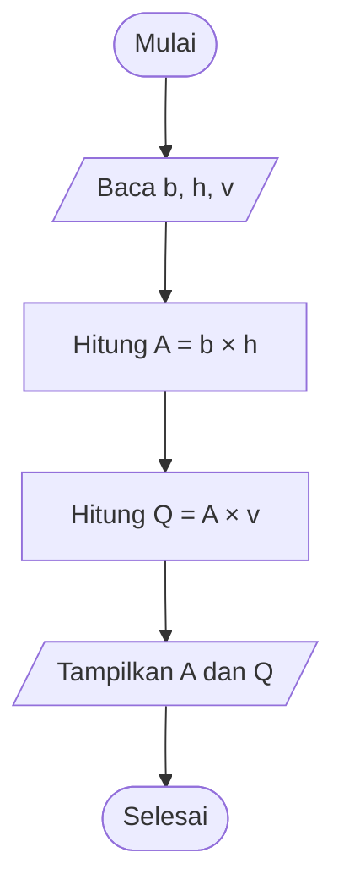

# Modul 2 — Representasi Masalah

## Capaian pembelajaran

Mahasiswa mampu:

- menulis algoritma dalam bentuk narasi, flowchart, dan pseudocode;
- memilih variabel serta tipe data VBA yang tepat;
- menggunakan operator aritmetika, perbandingan, dan logika;
- menjaga konsistensi satuan; dan
- membuat program input–output sederhana.

## Alur 100 menit

| Menit | Kegiatan | Bagian modul |
|---:|---|---|
| 0–10 | Pemantik kasus debit dan identifikasi input–output | §1 |
| 10–25 | Narasi, pseudocode, dan flowchart | §2 |
| 25–40 | Variabel, tipe data, operator, dan satuan | §3–5 |
| 40–60 | Demonstrasi kalkulator debit di Excel/VBA | §6 |
| 60–85 | Praktik pondasi: IPO → pseudocode → kode | §8 |
| 85–95 | Uji dengan kasus acuan dan koreksi pasangan | §8 |
| 95–100 | Checklist dan simpulan satu kalimat | Checklist dan Ringkasan |

**Keluaran minimum:** tabel input–proses–output, pseudocode pendek, satu flowchart, dan macro tekanan pondasi yang menghasilkan `150 kPa` untuk kasus acuan. `InputBox` (§7) dan tantangan konversi ton-gaya (§9) menjadi pengayaan/PR.

## 1. Kasus: debit aliran sederhana

Untuk penampang dengan kecepatan rata-rata seragam:

```text
Q = A × v
```

dengan `Q` = debit (m³/s), `A` = luas penampang (m²), dan `v` = kecepatan (m/s).

Untuk saluran persegi panjang, `A = b × h`, sehingga `Q = b × h × v`.

### Input–proses–output

| Komponen | Isi |
|---|---|
| Input | lebar `b`, kedalaman `h`, kecepatan `v` |
| Proses | hitung `A = b × h`, lalu `Q = A × v` |
| Output | luas `A` dan debit `Q` |

## 2. Tiga cara menuliskan algoritma

### Narasi

Baca lebar, kedalaman, dan kecepatan. Hitung luas penampang. Kalikan luas dengan kecepatan. Tampilkan luas dan debit.

### Pseudocode

```text
MULAI
  BACA lebar_m, kedalaman_m, kecepatan_ms
  luas_m2 ← lebar_m × kedalaman_m
  debit_m3s ← luas_m2 × kecepatan_ms
  TULIS luas_m2, debit_m3s
SELESAI
```

### Flowchart



GitHub dapat merender diagram Mermaid ini langsung pada halaman Markdown.

## 3. Variabel dan tipe data VBA

| Tipe | Contoh | Kegunaan |
|---|---|---|
| `Double` | `2.75` | ukuran, debit, luas, hasil desimal |
| `Long` | `1500` | jumlah baris atau penghitung loop |
| `String` | `"Saluran A"` | nama, kode, keterangan |
| `Boolean` | `True`/`False` | status valid/tidak, ya/tidak |
| `Date` | `#8/26/2026#` | tanggal pengukuran |
| `Variant` | bermacam nilai | fleksibel, tetapi gunakan hanya bila perlu |

Gunakan `Double` untuk sebagian besar besaran teknik. Hindari `Integer` untuk nomor baris karena kapasitasnya terbatas; gunakan `Long`.

```vb
Dim lebar_m As Double
Dim jumlahData As Long
Dim namaSaluran As String
Dim inputValid As Boolean
```

## 4. Operator penting

| Kelompok | Operator | Contoh |
|---|---|---|
| Aritmetika | `+ - * / ^` | `luas = lebar * tinggi` |
| Pembagian bulat | `\` | `7 \ 2` menghasilkan `3` |
| Sisa pembagian | `Mod` | `7 Mod 2` menghasilkan `1` |
| Perbandingan | `= <> < <= > >=` | `kedalaman > 0` |
| Logika | `And Or Not` | `lebar > 0 And tinggi > 0` |
| Gabung teks | `&` | `"Q = " & debit` |

Urutan operasi dapat dibuat eksplisit dengan tanda kurung. Tulis `(berat_kN / luas_m2)` jika itu memudahkan pembaca memahami rumus.

## 5. Satuan sebagai bagian algoritma

Kesalahan satuan dapat menghasilkan angka yang tampak wajar tetapi salah. Contoh konversi:

```text
250 cm = 250 / 100 = 2,5 m
500 L/s = 500 / 1000 = 0,5 m³/s
25 MPa = 25 N/mm² = 25.000 kN/m²
```

Praktik yang baik:

- tulis satuan pada label sel;
- masukkan satuan ke nama variabel (`lebar_m`, `debit_m3s`);
- konversi semua input ke satu sistem satuan sebelum menghitung; dan
- tampilkan satuan pada hasil, tetapi simpan nilai numeriknya sebagai angka.

## 6. Demonstrasi VBA — kalkulator debit

Siapkan lembar `KalkulatorDebit`:

| Sel | Isi |
|---|---|
| A2/A3/A4 | Lebar (m) / Kedalaman (m) / Kecepatan (m/s) |
| B2/B3/B4 | 3 / 0,8 / 1,25 |
| A6/A7 | Luas (m²) / Debit (m³/s) |

```vb
Option Explicit

Sub HitungDebitSaluran()
    Dim ws As Worksheet
    Dim lebar_m As Double
    Dim kedalaman_m As Double
    Dim kecepatan_ms As Double
    Dim luas_m2 As Double
    Dim debit_m3s As Double

    Set ws = ThisWorkbook.Worksheets("KalkulatorDebit")

    lebar_m = ws.Range("B2").Value
    kedalaman_m = ws.Range("B3").Value
    kecepatan_ms = ws.Range("B4").Value

    luas_m2 = lebar_m * kedalaman_m
    debit_m3s = luas_m2 * kecepatan_ms

    ws.Range("B6").Value = luas_m2
    ws.Range("B7").Value = debit_m3s
    ws.Range("B6:B7").NumberFormat = "0.000"
End Sub
```

Hasil acuan: `A = 2,4 m²` dan `Q = 3,0 m³/s`.

Menggunakan `ThisWorkbook.Worksheets(...)` lebih aman daripada `Range(...)` tanpa nama lembar karena kode tidak bergantung pada lembar yang sedang aktif.

## 7. InputBox dan MsgBox (pengayaan)

Untuk demonstrasi tanpa tabel:

```vb
Sub DebitDenganInputBox()
    Dim luas_m2 As Double
    Dim kecepatan_ms As Double
    Dim debit_m3s As Double

    luas_m2 = CDbl(InputBox("Masukkan luas penampang (m²):"))
    kecepatan_ms = CDbl(InputBox("Masukkan kecepatan (m/s):"))
    debit_m3s = luas_m2 * kecepatan_ms

    MsgBox "Debit = " & Format(debit_m3s, "0.000") & " m³/s"
End Sub
```

`CDbl` mengubah input teks menjadi `Double`. Pada modul berikutnya, input akan diperiksa sebelum dikonversi agar program tidak berhenti saat pengguna mengetik teks yang salah.

## 8. Praktik mandiri — tekanan merata

Buat algoritma dan program untuk menghitung tekanan rata-rata pada pondasi:

```text
q = P / (B × L)
```

dengan `P` dalam kN, `B` dan `L` dalam m, sehingga `q` dalam kN/m² atau kPa.

Produk yang dikumpulkan:

1. tabel input–proses–output;
2. pseudocode;
3. flowchart;
4. macro VBA; dan
5. satu hitungan manual sebagai pembanding.

Gunakan data awal `P = 900 kN`, `B = 2 m`, `L = 3 m`. Hasil acuan adalah `150 kPa`.

## 9. Tantangan pengayaan/PR

Tambahkan input beban dalam ton-gaya, lalu konversikan ke kN dengan asumsi `1 tf = 9,80665 kN`. Tuliskan asumsi konversi di lembar kerja, jangan menyembunyikannya di dalam kode.

## Checklist

- [ ] Semua variabel dideklarasikan dengan tipe yang sesuai.
- [ ] Nama variabel memuat makna dan satuan.
- [ ] Flowchart sesuai dengan kode yang dijalankan.
- [ ] Nilai hasil tetap numerik di sel Excel.
- [ ] Hasil program cocok dengan hitungan manual.

## Ringkasan

Representasi masalah menjembatani rumus teknik dan kode. Pseudocode serta flowchart membantu memeriksa urutan berpikir sebelum sintaks bahasa pemrograman menjadi perhatian utama.

[← Modul 1](01-pengantar-komputasi.md) · [Daftar modul](README.md) · [Modul 3 →](03-struktur-kontrol.md)
