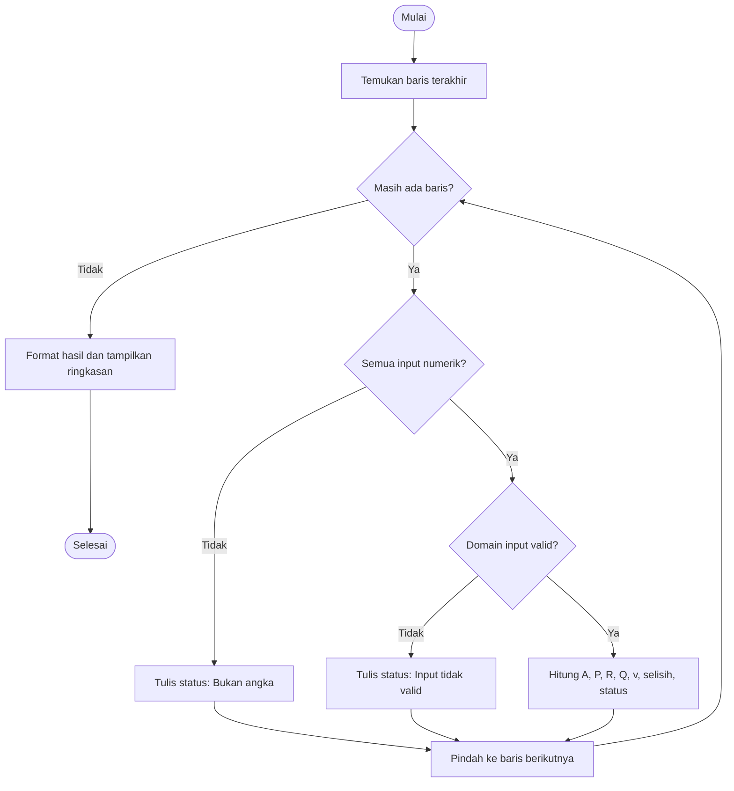

# Modul 7 — Praktik Integratif Pra-UTS

## Tujuan praktik

Pada praktik ini mahasiswa menyusun program kecil yang menggabungkan representasi masalah, struktur kontrol, struktur data, fungsi, validasi, debugging, dan pengujian. Produk akhir harus dapat didemonstrasikan sendiri dan diverifikasi terhadap hitungan manual.

## Alur 100 menit

| Menit | Kegiatan | Produk antara |
|---:|---|---|
| 0–10 | Brief kasus, batas pekerjaan, dan pembagian workbook | tabel input siap |
| 10–20 | Tandai input–proses–output dan lengkapi pseudocode | algoritma singkat |
| 20–32 | Hitung manual alternatif A | nilai acuan |
| 32–62 | Rakit program dengan memakai ulang fungsi Modul 6 | macro dapat dijalankan |
| 62–75 | Proses tiga data valid dan satu data salah | tabel hasil |
| 75–88 | Jalankan empat pengujian wajib | tabel uji |
| 88–97 | Demonstrasi bergiliran kepada pasangan | penjelasan lisan |
| 97–100 | Simpan `.xlsm`, checklist, dan *exit ticket* | berkas terkumpul |

**Keluaran minimum dalam kelas:** satu workbook `.xlsm`, satu pseudocode atau flowchart, tiga alternatif valid dan satu input salah, empat pengujian, serta satu verifikasi manual. README, grafik, video, dan pengembangan tampilan adalah pengayaan/PR.

### Agar realistis dalam 100 menit

- Dosen menyiapkan workbook dengan judul kolom dan empat baris data awal.
- Mahasiswa memakai kembali fungsi Manning dari Modul 6; fungsi tidak ditulis ulang dari nol.
- Mahasiswa fokus merakit alur utama, validasi, status, dan pengujian.
- Kode acuan pada §6 dibuka setelah mahasiswa mempunyai pseudocode dan mencoba programnya sendiri.

## Studi kasus: evaluator alternatif saluran persegi panjang

Program membaca beberapa alternatif geometri saluran dari Excel, menghitung parameter hidraulik sederhana dengan persamaan Manning, dan membandingkan debit hitungan dengan debit target.

> Studi kasus ini ditujukan untuk pembelajaran algoritma. Hasilnya bukan desain siap konstruksi dan tidak menggantikan analisis serta standar teknik yang berlaku.

## 1. Spesifikasi program

### Input per alternatif

- nama alternatif;
- lebar dasar `b` (m);
- kedalaman air `y` (m);
- koefisien Manning `n`;
- kemiringan energi `S` (m/m); dan
- debit target `Q_target` (m³/s).

### Proses

```text
A = b × y
P = b + 2y
R = A/P
Q = (1/n) × A × R^(2/3) × S^(1/2)
v = Q/A
selisih_persen = (Q - Q_target) / Q_target × 100%
```

### Output

- luas basah `A` (m²);
- keliling basah `P` (m);
- jari-jari hidraulik `R` (m);
- debit hitungan `Q` (m³/s);
- kecepatan rata-rata `v` (m/s);
- selisih terhadap target (%); dan
- status `Mencapai target` atau `Belum mencapai target`.

## 2. Struktur worksheet

Buat lembar bernama `Evaluasi`.

| Kolom | Judul |
|---|---|
| A | Alternatif |
| B | Lebar b (m) |
| C | Kedalaman y (m) |
| D | Manning n |
| E | Kemiringan S (m/m) |
| F | Q target (m³/s) |
| G | Luas A (m²) |
| H | Keliling P (m) |
| I | Radius R (m) |
| J | Q hitung (m³/s) |
| K | Kecepatan v (m/s) |
| L | Selisih (%) |
| M | Status |

Data awal yang dapat digunakan:

| Alternatif | b | y | n | S | Q target |
|---|---:|---:|---:|---:|---:|
| A | 2,00 | 1,00 | 0,015 | 0,0010 | 2,50 |
| B | 2,50 | 0,80 | 0,015 | 0,0010 | 2,50 |
| C | 1,80 | 1,20 | 0,017 | 0,0015 | 3,00 |
| Uji salah | 0,00 | 1,00 | 0,015 | 0,0010 | 2,00 |

## 3. Algoritma

```text
MULAI
  tentukan baris terakhir
  UNTUK setiap baris alternatif
    periksa bahwa B:F berisi angka
    JIKA bukan angka
      kosongkan hasil dan tulis "Bukan angka"
    JIKA angka tetapi domain input tidak valid
      kosongkan hasil dan tulis "Input tidak valid"
    SELAIN ITU
      hitung A, P, R, Q, v, dan selisih
      JIKA Q >= Q_target
        status ← "Mencapai target"
      SELAIN ITU
        status ← "Belum mencapai target"
      tulis seluruh hasil
  SELESAI UNTUK
  format angka dan tampilkan ringkasan
SELESAI
```

## 4. Flowchart



## 5. Rancangan modular

Program dibagi menjadi:

- `InputBarisNumerik`: memeriksa tipe input;
- `InputHidraulikValid`: memeriksa domain nilai;
- `DebitManningPersegi`: menghitung debit;
- `BersihkanHasil`: menghapus hasil lama; dan
- `EvaluasiSemuaAlternatif`: mengatur seluruh alur.

## 6. Implementasi acuan VBA

Mahasiswa menyusun versi sendiri dari pseudocode terlebih dahulu dan menggunakan kembali fungsi dari Modul 6. Kode lengkap berikut adalah pegangan ketika mengalami kebuntuan atau bahan pembanding setelah menit ke-62; mahasiswa tidak perlu mengetik ulang semua baris jika fungsi yang sama sudah tersedia.

```vb
Option Explicit

Private Function InputBarisNumerik( _
    ByVal ws As Worksheet, _
    ByVal baris As Long) As Boolean

    Dim kolom As Long

    InputBarisNumerik = True
    For kolom = 2 To 6
        If Not IsNumeric(ws.Cells(baris, kolom).Value) Then
            InputBarisNumerik = False
            Exit Function
        End If
    Next kolom
End Function

Private Function InputHidraulikValid( _
    ByVal lebar_m As Double, _
    ByVal kedalaman_m As Double, _
    ByVal koefManning As Double, _
    ByVal kemiringan As Double, _
    ByVal target_m3s As Double) As Boolean

    InputHidraulikValid = (lebar_m > 0) And _
                          (kedalaman_m > 0) And _
                          (koefManning > 0) And _
                          (kemiringan >= 0) And _
                          (target_m3s > 0)
End Function

Private Function DebitManningPersegi( _
    ByVal luas_m2 As Double, _
    ByVal radiusHidraulik_m As Double, _
    ByVal koefManning As Double, _
    ByVal kemiringan As Double) As Double

    DebitManningPersegi = (1# / koefManning) * luas_m2 * _
                           radiusHidraulik_m ^ (2# / 3#) * _
                           kemiringan ^ 0.5
End Function

Private Sub BersihkanHasil(ByVal ws As Worksheet, ByVal baris As Long)
    ws.Range(ws.Cells(baris, "G"), ws.Cells(baris, "L")).ClearContents
End Sub

Public Sub EvaluasiSemuaAlternatif()
    On Error GoTo TanganiGalat

    Dim ws As Worksheet
    Dim baris As Long
    Dim barisTerakhir As Long
    Dim jumlahValid As Long
    Dim lebar_m As Double
    Dim kedalaman_m As Double
    Dim koefManning As Double
    Dim kemiringan As Double
    Dim target_m3s As Double
    Dim luas_m2 As Double
    Dim kelilingBasah_m As Double
    Dim radiusHidraulik_m As Double
    Dim debit_m3s As Double
    Dim kecepatan_ms As Double
    Dim selisih_persen As Double

    Set ws = ThisWorkbook.Worksheets("Evaluasi")
    barisTerakhir = ws.Cells(ws.Rows.Count, "A").End(xlUp).Row

    For baris = 2 To barisTerakhir
        BersihkanHasil ws, baris

        If Not InputBarisNumerik(ws, baris) Then
            ws.Cells(baris, "M").Value = "Bukan angka"
        Else
            lebar_m = CDbl(ws.Cells(baris, "B").Value)
            kedalaman_m = CDbl(ws.Cells(baris, "C").Value)
            koefManning = CDbl(ws.Cells(baris, "D").Value)
            kemiringan = CDbl(ws.Cells(baris, "E").Value)
            target_m3s = CDbl(ws.Cells(baris, "F").Value)

            If Not InputHidraulikValid(lebar_m, kedalaman_m, _
                       koefManning, kemiringan, target_m3s) Then
                ws.Cells(baris, "M").Value = "Input tidak valid"
            Else
                luas_m2 = lebar_m * kedalaman_m
                kelilingBasah_m = lebar_m + 2# * kedalaman_m
                radiusHidraulik_m = luas_m2 / kelilingBasah_m
                debit_m3s = DebitManningPersegi(luas_m2, _
                              radiusHidraulik_m, koefManning, kemiringan)
                kecepatan_ms = debit_m3s / luas_m2
                selisih_persen = (debit_m3s - target_m3s) / _
                                  target_m3s * 100#

                ws.Cells(baris, "G").Value = luas_m2
                ws.Cells(baris, "H").Value = kelilingBasah_m
                ws.Cells(baris, "I").Value = radiusHidraulik_m
                ws.Cells(baris, "J").Value = debit_m3s
                ws.Cells(baris, "K").Value = kecepatan_ms
                ws.Cells(baris, "L").Value = selisih_persen

                If debit_m3s >= target_m3s Then
                    ws.Cells(baris, "M").Value = "Mencapai target"
                Else
                    ws.Cells(baris, "M").Value = "Belum mencapai target"
                End If

                jumlahValid = jumlahValid + 1
            End If
        End If
    Next baris

    ws.Range("G2:K" & barisTerakhir).NumberFormat = "0.0000"
    ws.Range("L2:L" & barisTerakhir).NumberFormat = "0.00"

    MsgBox jumlahValid & " alternatif berhasil dihitung.", vbInformation
    Exit Sub

TanganiGalat:
    MsgBox "Program berhenti: " & Err.Description, vbCritical
End Sub
```

## 7. Verifikasi manual alternatif A

Dengan `b = 2`, `y = 1`, `n = 0,015`, `S = 0,001`, dan target `2,5`:

```text
A = 2 × 1 = 2 m²
P = 2 + 2(1) = 4 m
R = 2/4 = 0,5 m
Q = (1/0,015) × 2 × 0,5^(2/3) × 0,001^(1/2)
Q ≈ 2,6561 m³/s
v = 2,6561/2 ≈ 1,3281 m/s
selisih ≈ (2,6561 - 2,5)/2,5 × 100% ≈ 6,25%
status = Mencapai target
```

Perbedaan kecil pada digit terakhir dapat terjadi karena pembulatan. Program harus menyimpan presisi penuh dan hanya membulatkan tampilan.

## 8. Rencana pengujian

| ID | Prioritas | Kasus | Contoh | Hasil yang diharapkan |
|---|---|---|---|---|
| T1 | Wajib | Normal/acuan | alternatif A | `Q ≈ 2,6561`; mencapai target |
| T2 | Pengayaan | Tepat target | atur target sama dengan Q hitung | mencapai target |
| T3 | Wajib | Dimensi nol | `b = 0` | input tidak valid |
| T4 | Pengayaan | Nilai negatif | `S = -0,001` | input tidak valid |
| T5 | Wajib | Salah tipe | `n = abc` | bukan angka |
| T6 | Wajib | Banyak baris | tiga valid + satu salah | semua baris tetap diproses |

Untuk setiap uji, catat input, hasil harapan, hasil aktual, dan status lulus/gagal. Empat uji wajib diselesaikan di kelas; dua uji pengayaan dapat ditambahkan setelah kelas.

## 9. Demonstrasi individu

Dalam waktu 3–5 menit, mahasiswa harus mampu:

1. menjelaskan input–proses–output;
2. menjalankan program pada satu kasus normal;
3. sengaja memasukkan satu data salah dan menjelaskan respons program;
4. menunjukkan satu verifikasi manual; dan
5. menjelaskan satu fungsi dan satu percabangan dalam kode.

## 10. Produk yang dikumpulkan

### Pada akhir pertemuan 100 menit

- workbook `.xlsm` dengan data, kode, dan hasil;
- satu pseudocode atau flowchart;
- tabel empat pengujian wajib; dan
- satu hitungan manual dengan selisih terhadap hasil program.

### Pengayaan/PR jika diperlukan

- `README.md` singkat berisi tujuan, cara menjalankan, asumsi, dan satuan;
- dua pengujian tambahan; dan
- tangkapan layar, grafik, atau video demonstrasi singkat.

## 11. Rubrik praktik integratif

| Aspek | Bobot | Indikator utama |
|---|---:|---|
| Algoritma dan modularitas | 20% | alur benar; fungsi/prosedur terpisah jelas |
| Ketepatan hitungan | 25% | rumus, satuan, dan hasil acuan benar |
| Validasi dan penanganan galat | 15% | input buruk ditangani tanpa hasil palsu |
| Pengujian dan verifikasi | 20% | empat kasus uji wajib dan satu hitungan manual |
| Keterbacaan dan dokumentasi | 10% | nama variabel, komentar, dan petunjuk jelas |
| Demonstrasi individu | 10% | mampu menjalankan dan menjelaskan program |

## 12. Pengembangan opsional/pengayaan

- beri warna hijau/kuning/merah pada status;
- buat grafik perbandingan `Q hitung` dan `Q target`;
- tambahkan tombol pada worksheet untuk menjalankan macro;
- pindahkan pengolahan tabel ke array 2D agar lebih efisien; atau
- tulis ulang satu fungsi dalam Python dan bandingkan hasilnya.

## Checklist akhir pra-UTS

- [ ] Workbook tersimpan sebagai `.xlsm` dan dapat dibuka ulang.
- [ ] Kode menggunakan `Option Explicit` dan berhasil di-compile.
- [ ] Tidak ada asumsi atau satuan penting yang tersembunyi.
- [ ] Program memproses semua baris, termasuk setelah baris yang salah.
- [ ] Hasil acuan cocok dalam toleransi yang dinyatakan.
- [ ] Saya mampu menjelaskan kode dengan kata-kata sendiri.

## Penutup

Program teknik yang baik bukan program yang paling panjang. Program yang baik memiliki alur jelas, input yang terjaga, perhitungan yang dapat ditelusuri, dan bukti bahwa hasilnya telah diuji.

[← Modul 6](06-otomasi-perhitungan-teknik-sipil.md) · [Daftar modul](README.md)
