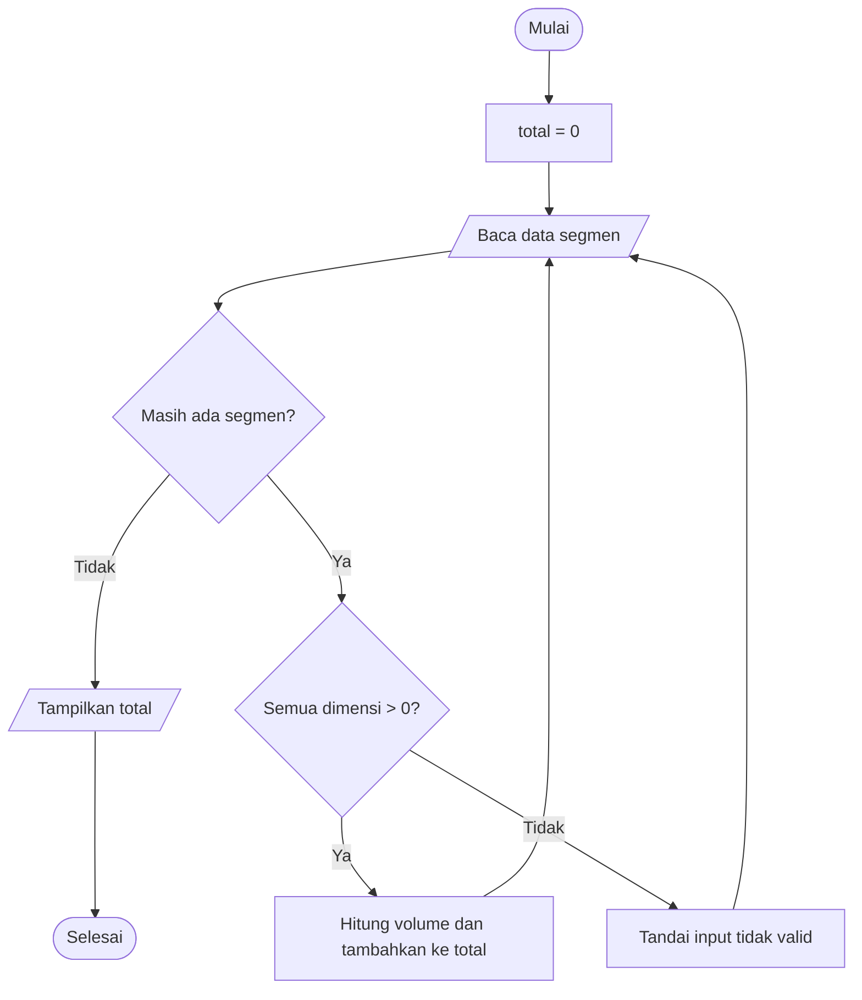

# Modul 4 — Algoritma dan Elemen-Elemennya

## Capaian pembelajaran

Mahasiswa mampu:

- memecah masalah teknik menjadi input–proses–output;
- menjelaskan urutan, percabangan, dan perulangan sebagai elemen algoritma;
- menulis algoritma dalam bahasa natural, pseudocode, dan flowchart;
- menelusuri algoritma menggunakan tabel jejak; dan
- menjelaskan hubungan algoritma dengan program komputer.

## Alur 100 menit

| Menit | Kegiatan |
|---:|---|
| 0–10 | Permainan menyusun langkah yang diacak |
| 10–25 | Definisi algoritma dan IPO |
| 25–40 | Urutan, keputusan, dan perulangan |
| 40–55 | Pseudocode kasus volume pekerjaan |
| 55–70 | Flowchart dan tabel jejak |
| 70–82 | Menerjemahkan algoritma ke Excel/VBA |
| 82–95 | Latihan singkat tiga soal |
| 95–100 | Pemeriksaan dan checklist |

**Keluaran minimum:** satu tabel IPO, pseudocode, flowchart, dan tabel jejak untuk satu kasus volume teknik sipil.

## 1. Pemecahan masalah menjadi langkah

Contoh persoalan: menghitung total volume galian dari beberapa segmen berbentuk balok.

Sebelum memikirkan kode, jawab:

1. data apa yang tersedia?
2. data apa yang belum tersedia?
3. rumus dan asumsi apa yang digunakan?
4. hasil apa yang dibutuhkan?
5. bagaimana mengetahui hasilnya benar?

### Input–proses–output

| Komponen | Isi |
|---|---|
| Input | panjang, lebar, kedalaman setiap segmen |
| Proses | validasi dimensi, hitung volume per segmen, jumlahkan |
| Output | volume tiap segmen dan total volume |
| Validasi | satu hitungan manual dan pemeriksaan semua dimensi positif |

## 2. Definisi algoritma

Algoritma adalah urutan langkah yang terbatas, jelas, dan dapat dijalankan untuk mengubah input menjadi output. Algoritma yang baik memiliki:

- awal dan akhir;
- input dan output yang jelas;
- langkah yang tidak ambigu;
- urutan yang dapat dilaksanakan;
- kondisi berhenti; dan
- cara memeriksa hasil.

Algoritma tidak bergantung pada bahasa. Algoritma yang sama dapat diterjemahkan ke formula Excel, VBA, Python, atau dikerjakan manual.

## 3. Tiga struktur dasar

### Urutan

Langkah dijalankan dari atas ke bawah.

```text
baca panjang
baca lebar
baca kedalaman
hitung volume
tampilkan volume
```

### Percabangan

Program memilih langkah berdasarkan kondisi.

```text
JIKA semua dimensi > 0
  hitung volume
LAINNYA
  tampilkan "Input tidak valid"
```

### Perulangan

Langkah yang sama diterapkan pada banyak data.

```text
UNTUK setiap segmen
  periksa dimensi
  hitung volume
  tambahkan ke total
SELESAI UNTUK
```

Semua program terstruktur dapat dibangun dari kombinasi ketiga pola ini.

## 4. Pseudocode lengkap

```text
MULAI
  total_m3 ← 0
  BACA jumlah_segmen

  UNTUK i ← 1 SAMPAI jumlah_segmen
    BACA panjang_m, lebar_m, kedalaman_m

    JIKA panjang_m > 0 DAN lebar_m > 0 DAN kedalaman_m > 0
      volume_m3 ← panjang_m × lebar_m × kedalaman_m
      total_m3 ← total_m3 + volume_m3
      TULIS volume_m3
    LAINNYA
      TULIS "Input tidak valid"
    SELESAI JIKA
  SELESAI UNTUK

  TULIS total_m3
SELESAI
```

`total_m3 ← 0` disebut inisialisasi. Tanpa nilai awal, penjumlahan berulang tidak memiliki titik mulai yang jelas.

## 5. Flowchart



Simbol oval menunjukkan awal/akhir, jajar genjang input/output, persegi panjang proses, dan belah ketupat keputusan.

## 6. Tabel jejak

Gunakan tiga segmen:

| Segmen | p | l | d | Volume | Total setelah langkah |
|---|---:|---:|---:|---:|---:|
| S1 | 10 | 2 | 1 | 20 | 20 |
| S2 | 5 | 2 | 1 | 10 | 30 |
| S3 | 4 | 0 | 1 | tidak valid | 30 |

Tabel jejak memperlihatkan perubahan variabel setelah setiap iterasi. Ini adalah alat debugging yang dapat digunakan bahkan sebelum kode ditulis.

## 7. Hubungan algoritma dan program

Baris pseudocode:

```text
volume_m3 ← panjang_m × lebar_m × kedalaman_m
```

dapat menjadi formula Excel:

```excel
=B2*C2*D2
```

atau perintah VBA:

```vb
volume_m3 = panjang_m * lebar_m * kedalaman_m
```

Bahasa mengubah cara penulisan, bukan logika dasarnya.

## Latihan singkat — 3 soal

### 1. Prediksi dan urutkan

Urutkan langkah berikut: `tampilkan hasil`, `validasi pembagi`, `baca gaya`, `hitung tegangan = gaya/luas`, `baca luas`. Tambahkan tindakan jika luas sama dengan nol.

### 2. Temukan kesalahan

Pseudocode total volume langsung menjalankan `total ← total + volume`, tetapi tidak pernah memberi nilai awal pada `total`. Prediksi akibatnya dan perbaiki algoritmanya.

### 3. Jelaskan dengan tabel jejak

Untuk data volume `3, 5, -2, 4`, algoritma hanya menjumlahkan nilai positif. Buat tabel jejak `i`, `nilai`, dan `total`, lalu jelaskan mengapa hasil akhirnya 12, bukan 10.

<details>
<summary>Kunci dan indikator pemahaman</summary>

1. Baca gaya → baca luas → validasi luas → jika luas bukan nol hitung tegangan → tampilkan hasil; jika nol tampilkan pesan dan jangan membagi.
2. Total tidak mempunyai keadaan awal yang pasti. Tambahkan `total ← 0` sebelum perulangan.
3. Total berubah `0→3→8→8→12`; `-2` dilewati, bukan ditambahkan. Mahasiswa harus membedakan “melewati data” dan “menambahkan nilai negatif”.

</details>

## Checklist

- [ ] Saya menentukan IPO sebelum menulis kode.
- [ ] Algoritma saya memiliki awal, akhir, dan kondisi berhenti.
- [ ] Saya membedakan urutan, percabangan, dan perulangan.
- [ ] Saya dapat menelusuri perubahan nilai dengan tabel jejak.

## Bacaan lanjut

1. Thomas H. Cormen, *Algorithms Unlocked*, MIT Press, 2013.
2. David Harel & Yishai Feldman, *Algorithmics: The Spirit of Computing*, 3rd ed., Addison-Wesley, 2004.
3. Thomas H. Cormen, Charles E. Leiserson, Ronald L. Rivest & Clifford Stein, *Introduction to Algorithms*, 4th ed., MIT Press, 2022.
4. Steven C. Chapra & Raymond P. Canale, *Numerical Methods for Engineers*, 8th ed., McGraw-Hill, 2021.

[← Modul 3](03-fungsi-excel-dan-if.md) · [Daftar modul](README.md) · [Modul 5 →](05-vba-dan-macro-linier.md)
